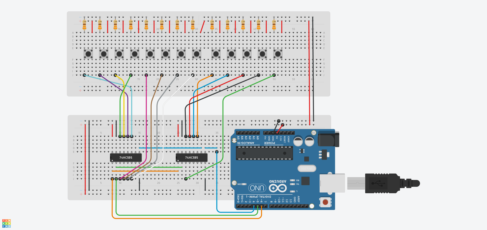

# Arduino Piano MIDI con 74HC165

Este es un proyecto de arduino para la creacion de un teclado / controlador midi con arduino. 
Para usar el teclado se tienen que ejecutar dos aplicaciones, una es [loopMIDI](https://www.tobias-erichsen.de/software/loopmidi.html) donde se creara un puerto midi el cual podras conectar a cualquier programa, y la otra es [Hairless MIDI](https://projectgus.github.io/hairless-midiserial/) el cual establecera una comunicacion entre el serial del arduino con nuestro puerto midi creado.

### Materiales a usar
- 1 Arduino (cualquier placa puede usarse siempre y cuando se adapte)
- 2 Circuitos 74HC595 ( pueden ser cualquier cantidad dependiendo de el numero de notas )
- N Pulsadores para las teclas
- N Cables para conectar
- N resistencias para hacer la conexion **Resistencia Pull-Down**

### Esquema del circuito

<b>Nota:</b> en el esquema se marca que los IC son <b>74HC595</b> los cuales <b>deben ser cambiados por los 74HC165.</b>

# Algunas fuentes

Para el desarrollo de este proyecto me base en los siguentes videos de youtube asi como en los codigos de los creadores.

- ["Construye tu propio controlador MIDI"](https://www.youtube.com/watch?v=dkFy9S-GjIo)  - Sistema de Bibliotecas - Alcaldía de Medellín
- ["¿Cómo crear nuestro propio dispositivo de comunicación MIDI?... Con arduino."](https://www.youtube.com/watch?v=pIFoOQJEFZ0&t=1s)  - DH Cast
- ["Multiplexor de entradas arduino digital"](https://www.youtube.com/watch?v=OXIIHRF_14o&t=33s)  - DH Cast

# Links recomendados

- [Link Aqui](https://www.arduino.cc) - Pagina oficial de arduino
- [Link Aqui](https://www.alldatasheet.es/datasheet-pdf/pdf/15549/PHILIPS/74HC165.html) - Pines del 74HC165 - AllDatasheet
- [Link Aqui](https://es.wikipedia.org/wiki/MIDI) - Que es midi? - Wikipedia
- [Link Aqui](https://sonic-pi.mehackit.org/assets/img/es/midi_notes_es.png) - Imagen de las notas en MIDI
